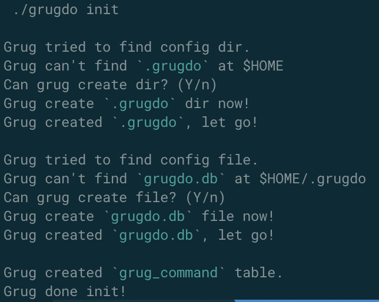
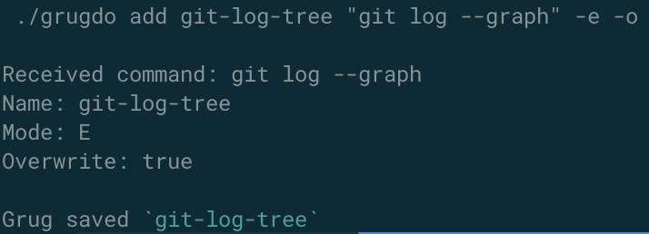
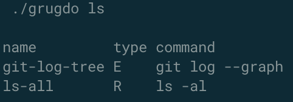
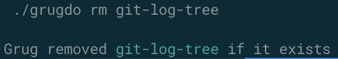
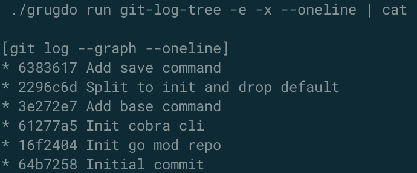

# grugdo
Grug do stuffs

[Grug](https://grugbrain.dev/) is good programmer.
But Grug have bad memory.
Grug can't remember long commands.
So Grug let machine remember them.
Then grug tell machine to run commands.
But don't store password, Grug won't take care of it.
Grug happy!

## 1. Installation
You can clone and with **go version 1.21.x**, run:
```bash
go build && ./grugdo -h
```
or:
```bash
go install && grugdo -h
```

If you build, `grugdo` is available only at local dir.

If you install, `grugdo` is available at `GOROOT`.

Or if you're good dev, like Grug, just put the binary in your path.

Grug ready to go!

## 2. Init
Run `grugdo init`

Grug will create `~/.grugdo/grugdo.db` to store commands.



## 3. Add command
Run `grugdo add git-log-tree "git log --graph"`

Add `-e` to make it executable because Grug will default to remind mode only.

Add `-o` to overwrite saved command.



## 4. List command
Run `grugdo ls`

You can also pipe it `grugdo ls | less`



## 5.Remove command
Run `grugdo rm git-log-tree`



## 6. Run command
Run in remind mode `grugdo run git-log-tree`

Run in execute mode `grugdo run -e git-log-tree`

You can add arguments and flags to it `grugdo run git-log-tree -x --all -x --oneline`

You can also save it to bash file `grugdo run git-log-tree -f something.sh`



## 7. Grug done!
